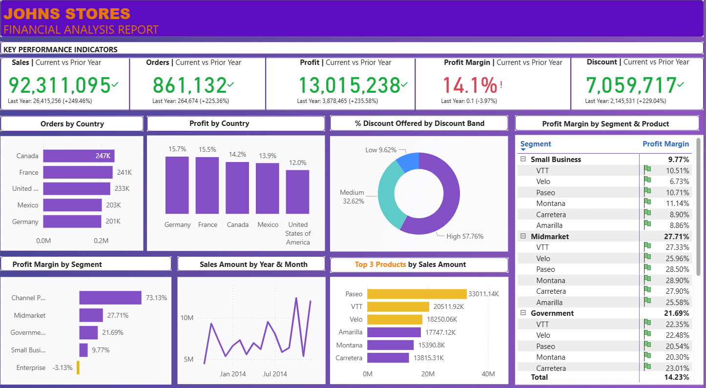

# Finance-Data-Analytics-PowerBI
End-to-end finance data analysis using Power BI with data modeling, DAX, time intelligence, KPIs, and profit margin insights.
# 📊 Finance Analytics Dashboard (Power BI)

📌 Project Overview

This project focuses on end-to-end Finance Data Analysis using Power BI, where raw financial data is transformed into meaningful business insights through data modeling, DAX calculations, and interactive visualizations.

The dashboard helps stakeholders track performance, analyze profit margins, and make data-driven decisions.

---

🎯 Objectives

* Analyze financial performance across time and segments
* Track key KPIs such as Revenue, Profit, and Profit Margin
* Perform time-based analysis for better trend understanding
* Deliver clear and interactive visual insights

---

🔧 Key Features & Workflow

1️⃣ Data Transformation & Loading

* Cleaned and prepared raw financial data
* Handled missing values and formatted columns
* Loaded data into Power BI for analysis

2️⃣ Data Modeling

* Created relationships between financial tables
* Optimized data model for accurate calculations

3️⃣ Data Analysis using DAX

* Developed calculated measures for business metrics
* Used DAX to derive meaningful insights

4️⃣ Time Intelligence Calculations

* Year-over-Year (YoY)
* Month-over-Month (MoM)
* Year-to-Date (YTD)

5️⃣ KPI Visualizations

* Revenue
* Profit
* Profit Margin
* Performance indicators for quick decision-making

6️⃣ Profit Margin Analysis by Segment

* Segment-wise profit comparison
* Identification of high and low-performing segments

---

🛠 Tools & Technologies

* Power BI
* DAX (Data Analysis Expressions)
* Microsoft Excel
* Data Modeling & Visualization

---

📈 Dashboard Insights

* Clear visibility into financial trends over time
* Identification of profitable and underperforming segments
* Improved financial decision support through KPIs

---

📊 Dashboard File
👉 ## 📊 Dashboard Preview

---

📂 Repository Contents

* `Financial Sample.xlsx` – Dataset used for analysis
* `Financial Analysis Dashboard.png` – Power BI dashboard file
* `README.md` – Project documentation

---

🚀 How to Use

1. Download the `.pbix` file
2. Open using **Power BI Desktop**
3. Refresh data if required
4. Explore interactive visuals and insights

---

🙋‍♀️ About Me

Aspiring **Data Analyst** with hands-on experience in Power BI, DAX, and financial data analysis. Actively seeking entry-level opportunities to apply analytical skills in real-world business scenarios.

📌 *Feedback and suggestions are always welcome!*
